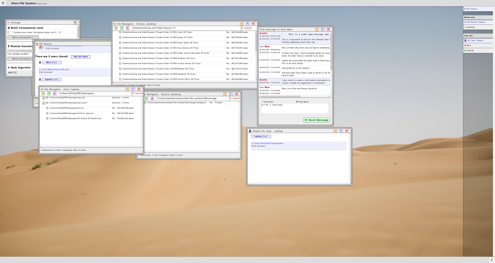
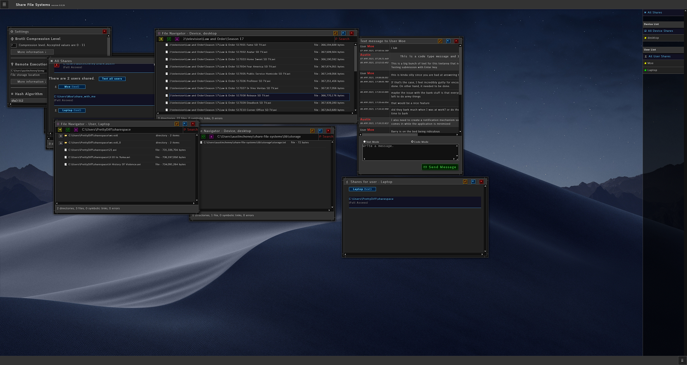
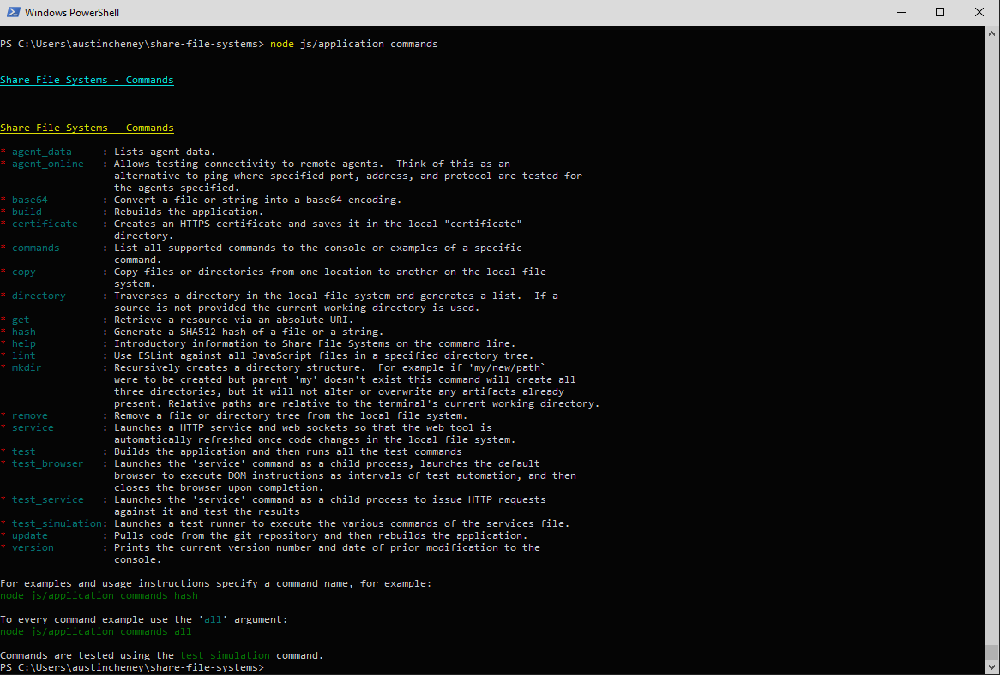
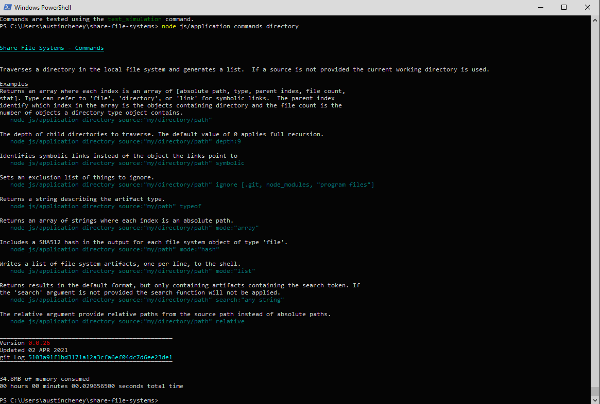
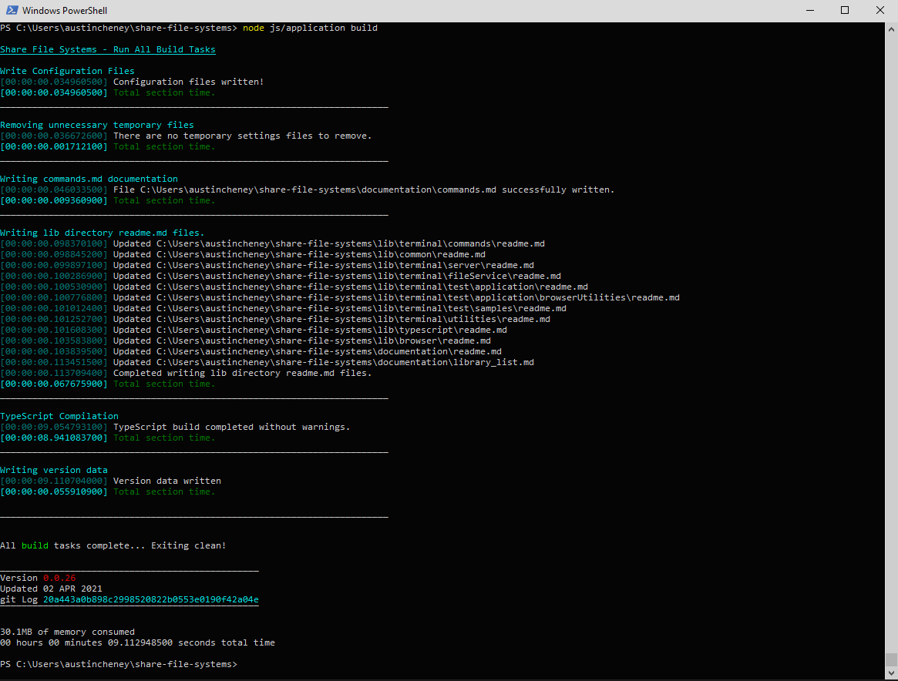

<!-- documentation/screenshots - A list of screenshots demonstrating what the application looks like. -->

# Share File System - Screenshots

## Browser UI
*  [Browser, default color scheme](screenshots/browser_defaultScheme_manyModals.png)
*  [Browser, dark color scheme](screenshots/browser_darkScheme_manyModals.png)

## Terminal messaging
*  [Terminal command documentation](screenshots/terminal_commands.png)
*  [Terminal command documentation, directory details](screenshots/terminal_commands_directory.png)
*  [Terminal build messaging](screenshots/terminal_build.png)